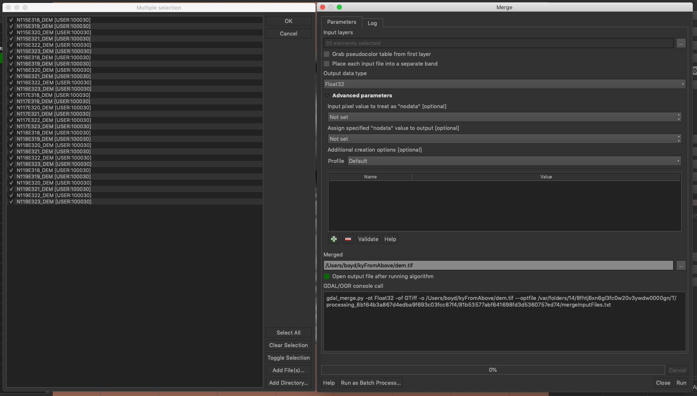

# Wildcat Eyes
Harvesting Kentucky's trove of remote sensing data


## Location and time

[Map to Miller Hall](https://maptimelex.github.io/location/) | [Presentation](https://gitpitch.com/maptimelex/wildcat-eyes) | Thursday, November 14, 6 PM Lexington, KY

<!-- TOC -->

- [Wildcat Eyes](#wildcat-eyes)
    - [Location and time](#location-and-time)
    - [TL;DR](#tldr)
    - [Preamble](#preamble)
    - [The data source](#the-data-source)
        - [Select your grids](#select-your-grids)
        - [Automate download and extraction](#automate-download-and-extraction)

<!-- /TOC -->

## TL;DR

Use these [indexes](assets/data) to find desired remote sensing data as tiles and then use a Jupyter Notebook ([Windows](windows-version.ipynb) or [Linux/macOS](macos-version.ipynb) version) to download and extract imagery. The Windows version will use [Potree](http://potree.org/) to render point clouds as an interactive 3D map displayed in your browser.

## Preamble

Remote sensing data can be difficult to handle, especially over a large area. While we have imagery base maps that we can load as image services or raster tile sets, we often need the source imagery. Using local high-resolution imagery is more performative and allows use in other programs, like Adobe Photoshop. The problem is downloading and extracting imagery. It's boring! Then, we add other formats like lidar point clouds that require a custom Windows command line utility. This is becoming total drudgery! Let's programmatically manage our remote data so we can spend more time playing with locally.


## The data source

Kentucky's [KyFromAbove](http://kyfromabove.ky.gov/) initiative to collect high-resolution aerial imagery and elevation data began in 2010 and continues today. Lidar point cloud and 5-ft DEM layers are available for the entire state, though in 5,000 ft x 5,000 ft tiles. KyFromAbove is actively collecting 6-in resolution leaf-off aerial photography and lidar for 2019/2020. 

In addition to these assets, the state also host [NAIP imagery](https://www.fsa.usda.gov/programs-and-services/aerial-photography/imagery-programs/naip-imagery/), at various resolutions, from 2006 to 2018. They are available in 10k and 20k grids. You can peruse the FTP site where the data are publicly available: [ftp.kymartian.ky.gov](ftp://ftp.kymartian.ky.gov).

### Select your grids

Let's say you want to download DEMs for an area of interest. Select the appropriate grid layer from our [collection indexes](assets/data) and load it into QGIS.

    
*Load grid into QGIS*

Select the grids that you would like to download.

    
*Using select tool to select desired grids*

Right-click the grid layer and click **Export > Save Selected Features As...**. 

    
*Saving desired tile labels*

Export the grid layer as a CSV without geometry using only the *ftppath* attribute. Also, make sure to enable the *STRING_QUOTING* property.

    
*Export CSV parameters*

 This will give us the URLs to download the tiles. Add a comma after each line and remove any lines that are not URLs. A find and replace in a text editor can be helpful with this task. Lastly, make sure the last line does not end with a comma. 

     
*Preparing names for extraction*

### Automate download and extraction

Now we can add the names as a Python list in the following code (or use a Jupyter Notebook version: [Windows](windows-version.ipynb) or [Linux/macOS](macos-version.ipynb)).

```python
# Subprocess allows us to issue commands on the command line
import subprocess
# Module to download files with an URL
import urllib.request
# Zip utlity to extract files
from zipfile import ZipFile

############### Project properties ###############

# Root GIS directory
root = "/Users/boyd"

# Project name - creates a folder in project directory
project = "kyFromAbove"

# 2018, 2016, 2006 (2 ft resolution orthophoto)
# 2014, 2012, 2010, 2008 (1 M resolution orthophoto)
# Some years have 1 ft and 6 inch resolution
# Check tile index grids!
# Specifying a year has no impact on downloading lidar or DEM data
year = "2012" 

data_names = [
"ftp://ftp.kymartian.ky.gov/kyaped/DEMs_5FT/N115E318_DEM.zip",
"ftp://ftp.kymartian.ky.gov/kyaped/DEMs_5FT/N115E319_DEM.zip",
"ftp://ftp.kymartian.ky.gov/kyaped/DEMs_5FT/N115E320_DEM.zip",
"ftp://ftp.kymartian.ky.gov/kyaped/DEMs_5FT/N115E321_DEM.zip",
"ftp://ftp.kymartian.ky.gov/kyaped/DEMs_5FT/N116E318_DEM.zip",
"ftp://ftp.kymartian.ky.gov/kyaped/DEMs_5FT/N116E319_DEM.zip",
"ftp://ftp.kymartian.ky.gov/kyaped/DEMs_5FT/N116E320_DEM.zip",
"ftp://ftp.kymartian.ky.gov/kyaped/DEMs_5FT/N117E318_DEM.zip",
"ftp://ftp.kymartian.ky.gov/kyaped/DEMs_5FT/N117E319_DEM.zip",
"ftp://ftp.kymartian.ky.gov/kyaped/DEMs_5FT/N117E320_DEM.zip",
"ftp://ftp.kymartian.ky.gov/kyaped/DEMs_5FT/N118E318_DEM.zip",
"ftp://ftp.kymartian.ky.gov/kyaped/DEMs_5FT/N118E319_DEM.zip",
"ftp://ftp.kymartian.ky.gov/kyaped/DEMs_5FT/N119E318_DEM.zip",
"ftp://ftp.kymartian.ky.gov/kyaped/DEMs_5FT/N119E319_DEM.zip",
"ftp://ftp.kymartian.ky.gov/kyaped/DEMs_5FT/N115E322_DEM.zip",
"ftp://ftp.kymartian.ky.gov/kyaped/DEMs_5FT/N115E323_DEM.zip",
"ftp://ftp.kymartian.ky.gov/kyaped/DEMs_5FT/N116E321_DEM.zip",
"ftp://ftp.kymartian.ky.gov/kyaped/DEMs_5FT/N116E322_DEM.zip",
"ftp://ftp.kymartian.ky.gov/kyaped/DEMs_5FT/N116E323_DEM.zip",
"ftp://ftp.kymartian.ky.gov/kyaped/DEMs_5FT/N117E321_DEM.zip",
"ftp://ftp.kymartian.ky.gov/kyaped/DEMs_5FT/N117E322_DEM.zip",
"ftp://ftp.kymartian.ky.gov/kyaped/DEMs_5FT/N117E323_DEM.zip",
"ftp://ftp.kymartian.ky.gov/kyaped/DEMs_5FT/N118E320_DEM.zip",
"ftp://ftp.kymartian.ky.gov/kyaped/DEMs_5FT/N118E321_DEM.zip",
"ftp://ftp.kymartian.ky.gov/kyaped/DEMs_5FT/N118E322_DEM.zip",
"ftp://ftp.kymartian.ky.gov/kyaped/DEMs_5FT/N118E323_DEM.zip",
"ftp://ftp.kymartian.ky.gov/kyaped/DEMs_5FT/N119E320_DEM.zip",
"ftp://ftp.kymartian.ky.gov/kyaped/DEMs_5FT/N119E321_DEM.zip",
"ftp://ftp.kymartian.ky.gov/kyaped/DEMs_5FT/N119E322_DEM.zip",
"ftp://ftp.kymartian.ky.gov/kyaped/DEMs_5FT/N119E323_DEM.zip"
]

if f"{year}" not in data_names[0]:
    print("Check your year and tile names. NAIP years 2018, 2016, and 2018 use a 10k grid. The other years use a 20k grid.")

# Populate project folder with asset folders
downloads = f'{root}/{project}/downloads'
lidar = f'{root}/{project}/lidar'
naip_year = f'{root}/{project}/{year}'
dem = f'{root}/{project}/dem'

# Create folders
folders = [f'{root}/{project}', downloads, lidar, naip_year, dem]
for folder in folders:
    subprocess.run(f'mkdir {folder}', shell=True, stdout=subprocess.PIPE)
    print(f"mkdir {folder}")
    
# Show contents of project directory
completed = subprocess.run(f'ls -la {root}/{project}', shell=True, stdout=subprocess.PIPE)
print(completed.stdout.decode('UTF-8'))

i = 0
names= []

# Download LAZ
if "laz" in data_names[0][-3:].lower():
    las_names = []
    for url in data_names:
        name = url[-12:]
        las_names.append(f'{lidar}{url[-12:-4]}.las')
        with urllib.request.urlopen(url) as response: 
            print(f'Downloading {url}')
            with open(f'{downloads}{name}', 'wb') as outFile:
                data = response.read()
                outFile.write(data)
        i += 1
# Download NAIP
elif "naip" in data_names[0][-22:-18].lower():
    extension = "jpg"
    if year == "2016":
        naip_prefix = "ky_2ft_naip_2016_"
        directory = "FSA_NAIP_2016_2FT"
    elif year == "2018":
        naip_prefix = "KY_2FT_NAIP_2018_"
        extension = "tif"
        directory = "FSA_NAIP_2018_2FT"
    elif year == "2006":
        naip_prefix = "ky_2ft_naip_2006_"
        directory = "FSA_NAIP_2006_2FT"
    elif year == "2008":
        naip_prefix = "ky_1m_naip_2008_"
        directory = "FSA_NAIP_2008_1M"
    elif year == "2010":
        naip_prefix = "ky_1m_naip_2010_"
        directory = "FSA_NAIP_2010_1M"
    elif year == "2012":
        naip_prefix = "ky_1m_naip_2012_"
        directory = "FSA_NAIP_2012_1M"
    elif year == "2014":
        naip_prefix = "ky_1m_naip_2014_"
        directory = "FSA_NAIP_2014_1M"
    for url in data_names:
        name = url[-12:-4]
        names.append(name)
        url = f"ftp://ftp.kymartian.ky.gov/{directory}/{naip_prefix}{name}.zip"
        print(f'Downloading {url}')
        with urllib.request.urlopen(url) as response: 
            with open(f'{downloads}/{name}.zip', 'wb') as outFile:
                data = response.read()
                outFile.write(data) 
        with ZipFile(f'{downloads}/{name}.zip', 'r') as zip: 
            zip.extractall(f'{downloads}/{name}')
        print(f'mv {downloads}/{name}/*.* {naip_year}')
        completed = subprocess.run(f'mv {downloads}/{name}/*.* {naip_year}', shell=True, stdout=subprocess.PIPE)
        print(completed.stdout.decode('UTF-8'))
        i += 1
# Download DEM
elif "dem" in data_names[0][-7:-4].lower():
    for url in data_names:
        name = url[-16:-4]
        names.append(name)
        url = f"ftp://ftp.kymartian.ky.gov/kyaped/DEMs_5FT/{name}.zip"
        print(f'Downloading {url}')
        with urllib.request.urlopen(url) as response: 
            with open(f'{downloads}/{name}.zip', 'wb') as outFile:
                data = response.read()
                outFile.write(data) 
        with ZipFile(f'{downloads}/{name}.zip', 'r') as zip: 
            zip.extractall(f'{downloads}/{name}')
        print(f'mv {downloads}/{name}/*.* {dem}')
        completed = subprocess.run(f'mv {downloads}/{name}/*.* {dem}', shell=True, stdout=subprocess.PIPE)
        print(completed.stdout.decode('UTF-8'))
        i += 1
# Download HiRes Aerial
elif "1ft" in data_names[0][-16:-13].lower():
    for url in data_names:
        name = url[-12:-4]
        names.append(name)
        url = f"ftp://ftp.kymartian.ky.gov/kyaped/KYAPED_2012_1FT/{name}.zip"
        print(f'Downloading {url}')
        with urllib.request.urlopen(url) as response: 
            with open(f'{downloads}/{name}.zip', 'wb') as outFile:
                data = response.read()
                outFile.write(data) 
        with ZipFile(f'{downloads}/{name}.zip', 'r') as zip: 
            zip.extractall(f'{downloads}/{name}')
        print(f'mv {downloads}/{name}/*.* {year}')
        completed = subprocess.run(f'mv {downloads}/{name}/*.* {naip_year}', shell=True, stdout=subprocess.PIPE)
        print(completed.stdout.decode('UTF-8'))
        i += 1
# Assume it is 6in
else:
    for url in data_names:
        name = url[-12:-4]
        names.append(name)
        print(f'Downloading {url}')
        with urllib.request.urlopen(url) as response: 
            with open(f'{downloads}/{name}.zip', 'wb') as outFile:
                data = response.read()
                outFile.write(data) 
        with ZipFile(f'{downloads}/{name}.zip', 'r') as zip: 
            zip.extractall(f'{downloads}/{name}')
        print(f'mv {downloads}/{name}/*.* {year}')
        completed = subprocess.run(f'mv {downloads}/{name}/*.* {naip_year}', shell=True, stdout=subprocess.PIPE)
        print(completed.stdout.decode('UTF-8'))
        i += 1
        
for i in names:
    print(f"Downloaded: {i}")

# Clean Downloads...
completed = subprocess.run(f'rm -fr {downloads}/*', shell=True, stdout=subprocess.PIPE)
print(completed.stdout.decode('UTF-8'))
```

After the script successfully completes, you should have a folder called *DEM* with a series of ERDAS IMAGINE image files, *.img*. Add those to QGIS.

    
*Viewing DEMs in QGIS*

We can then use the QGIS tool **Raster > Miscellaneous > Merge** to create a single image. Similarly, a command line GDAL tool would be close to the following example where the `list.txt` is the location of your *.img* files.

```bash
gdal_merge.py -ot Float32 -of GTiff -o /Users/boyd/kyFromAbove/dem.tif --optfile list.txt
```

    
*Merging raster tiles to a single image*

After merging, you can operate on this area as a single image. 

    
*Final raster*

Now, with these tools and highest resolution public data available, you can laser wildcat eyes in Kentucky! If you are on Windows, use the Windows Jupyter Notebook and take advantage of the unique access to statewide lidar to make your interactive 3D point cloud.

    
*Point cloud rendered in Potree*
